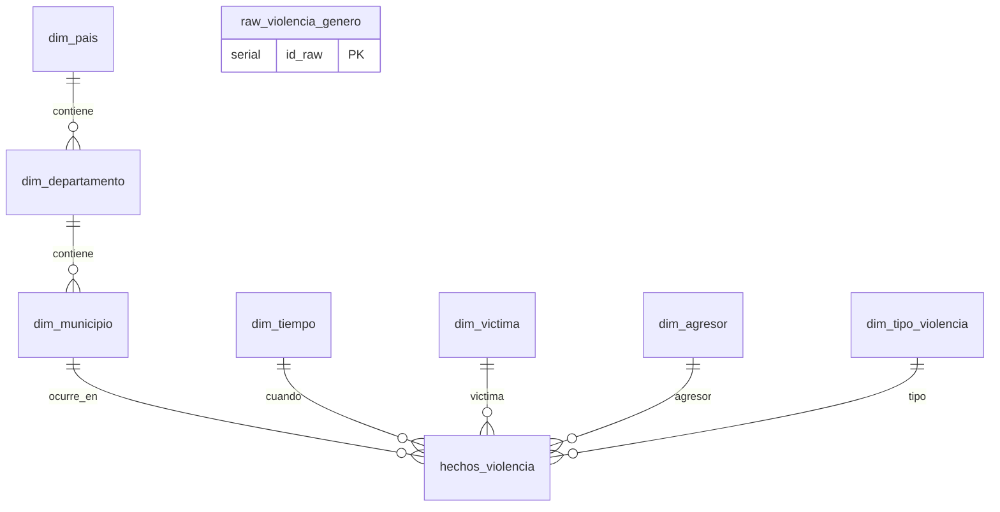

# 📖 Diccionario de Datos
### Data Warehouse — Violencia de Género en Colombia (ODS 5)

*Ficha técnica de cada tabla, columna, tipo de dato y regla de negocio del Data Warehouse.*
*Generado a partir de `sql/raw_violencia_genero.sql` y `sql/esquema_violencia_genero.sql`, y validado contra el extracto real `hechos_violencia.csv` (7,872 filas exportadas del Data Warehouse).*

---

## 📑 Contenido

- [🗺️ Mapa del modelo](#️-mapa-del-modelo)
- [🧾 Convenciones](#-convenciones)
- [1. `raw_violencia_genero` — Tabla cruda](#1-raw_violencia_genero--tabla-cruda)
- [2. `dim_pais`](#2-dim_pais)
- [3. `dim_departamento`](#3-dim_departamento)
- [4. `dim_municipio`](#4-dim_municipio)
- [5. `dim_tiempo`](#5-dim_tiempo)
- [6. `dim_victima`](#6-dim_victima)
- [7. `dim_agresor`](#7-dim_agresor)
- [8. `dim_tipo_violencia`](#8-dim_tipo_violencia)
- [9. `hechos_violencia` — Tabla de hechos](#9-hechos_violencia--tabla-de-hechos)
- [🔤 Diccionario de dominios (códigos del CSV original)](#-diccionario-de-dominios-códigos-del-csv-original)

---

## 🗺️ Mapa del modelo

> `raw_violencia_genero` es independiente del esquema estrella: es la **zona de aterrizaje (landing zone)** del CSV original, previa a la transformación.

## 🧾 Convenciones

| Símbolo | Significado |
|:---:|---|
| 🔑 | Llave primaria (PK) |
| 🔗 | Llave foránea (FK) |
| ⚠️ | Campo con validación / `CHECK` |
| ❓ | Acepta valores nulos |

---

## 1. `raw_violencia_genero` — Tabla cruda

> Zona de aterrizaje del CSV original (`bucaramanga_violencia.csv.csv`), sin transformar. Preserva la estructura y nombres tal como llegan de SIVIGILA, para trazabilidad y auditoría.

| # | Campo | Tipo de dato | ¿Nulo? | Descripción | Campo original del CSV |
|---|---|:---:|:---:|---|---|
| 1 | `id_raw` 🔑 | `SERIAL` | No | Identificador autonumérico del registro crudo | — (generado) |
| 2 | `orden` | `TEXT` | ❓ | Consecutivo autonumérico del registro origen | `Orden` |
| 3 | `departamento` | `TEXT` | ❓ | Nombre del departamento de procedencia de la víctima | `Departamento` |
| 4 | `municipio` | `TEXT` | ❓ | Nombre del municipio de procedencia de la víctima | `Municipio` |
| 5 | `semana` | `TEXT` | ❓ | Semana epidemiológica en la que ocurrió el evento | `semana` |
| 6 | `year` | `TEXT` | ❓ | Año correspondiente a la semana epidemiológica | `año` |
| 7 | `grupo_edad` | `TEXT` | ❓ | Rango de edad al que pertenece la víctima | `Grupo edad` |
| 8 | `ciclo_vida` | `TEXT` | ❓ | Clasificación de la edad según Min. Salud (ver [dominios](#-diccionario-de-dominios-códigos-del-csv-original)) | `Ciclo de vida` |
| 9 | `sexo` | `TEXT` | ❓ | Sexo biológico de la víctima | `sexo_` |
| 10 | `area` | `TEXT` | ❓ | Zona de ocurrencia del evento (cabecera / centro poblado / rural) | `area_` |
| 11 | `barrio` | `TEXT` | ❓ | Barrio o vereda de ocurrencia | `Barrio` |
| 12 | `comuna` | `TEXT` | ❓ | Nombre de la comuna | `Comuna` |
| 13 | `tipo_seguridad_social` | `TEXT` | ❓ | Régimen de salud (C/S/P/E/N/I) | `Tipo de Seguridad Social` |
| 14 | `pac_hos` | `TEXT` | ❓ | Si la víctima fue hospitalizada (1=Sí, 2=No) | `pac_hos_` |
| 15 | `con_fin` | `TEXT` | ❓ | Condición final (1=Vivo, 2=Muerto, 3=No sabe) | `con_fin_` |
| 16 | `version` | `TEXT` | ❓ | Versión de SIVIGILA del registro | `version` |
| 17 | `naturaleza` | `TEXT` | ❓ | Modalidad de violencia (código numérico, 1-12) | `naturaleza` |
| 18 | `def_naturaleza` | `TEXT` | ❓ | Modalidad de violencia (descripción textual) | `def_naturaleza` |
| 19 | `actividad` | `TEXT` | ❓ | Código de actividad u oficio de la víctima | `actividad` |
| 20 | `nom_actividad` | `TEXT` | ❓ | Nombre de la actividad u oficio | `nom_actividad` |
| 21 | `edad_agre` | `TEXT` | ❓ | Edad aparente del agresor(a) | `edad_agre` |
| 22 | `sexo_agre` | `TEXT` | ❓ | Sexo del agresor(a) (M/F/SD/I) | `sexo_agre` |
| 23 | `parentezco_vict` | `TEXT` | ❓ | Relación/parentesco del agresor con la víctima | `parentezco_vict` |
| 24 | `sust_vict` | `TEXT` | ❓ | Presencia de alcohol/sustancias en la víctima | `sust_vict` |
| 25 | `fec_hecho` | `TEXT` | ❓ | Fecha del hecho | `fec_hecho` |
| 26 | `hora_hecho` | `TEXT` | ❓ | Hora del hecho | `hora_hecho` |
| 27 | `escenario` | `TEXT` | ❓ | Escenario donde ocurrió el hecho | `escenario` |
| 28 | `zona_conf` | `TEXT` | ❓ | Ámbito de la violencia según lugar de ocurrencia | `zona_conf` |
| 29 | `nom_eve` | `TEXT` | ❓ | Nombre del evento | `nom_eve` |
| 30 | `nom_upgd` | `TEXT` | ❓ | Nombre de la Unidad Primaria Generadora de Datos | `nom_upgd` |
| 31 | `ndep_resi` | `TEXT` | ❓ | Departamento de residencia de la víctima | `ndep_resi` |
| 32 | `nmun_resi` | `TEXT` | ❓ | Municipio de residencia de la víctima | `nmun_resi` |
| 33 | `mes` | `TEXT` | ❓ | Mes en el que ocurrieron los hechos | `MES` |

> 🚫 **No migran al modelo final:** `orden`, `version`, `nom_eve`, `nom_upgd`, `barrio`, `comuna`, `ndep_resi`, `nmun_resi` → son metadatos del sistema o generan redundancia/ruido geográfico (ver justificación en el [`README.md`](../README.md)).

---

## 2. `dim_pais`

> Nivel más alto de la jerarquía geográfica.

| Campo | Tipo de dato | ¿Nulo? | Restricción | Descripción |
|---|:---:|:---:|---|---|
| `id_pais` 🔑 | `SERIAL` | No | `PRIMARY KEY` | Identificador único del país |
| `nombre_pais` | `VARCHAR(60)` | No | `UNIQUE`, `DEFAULT 'Colombia'` | Nombre del país |

---

## 3. `dim_departamento`

> Nivel intermedio de la jerarquía geográfica.

| Campo | Tipo de dato | ¿Nulo? | Restricción | Descripción |
|---|:---:|:---:|---|---|
| `id_departamento` 🔑 | `SERIAL` | No | `PRIMARY KEY` | Identificador único del departamento |
| `id_pais` 🔗 | `INT` | No | `REFERENCES dim_pais(id_pais)` | País al que pertenece |
| `nombre_departamento` | `VARCHAR(60)` | No | `UNIQUE (id_pais, nombre_departamento)` | Nombre del departamento (ej. Santander) |

---

## 4. `dim_municipio`

> Nivel más bajo de la jerarquía geográfica; se conecta directamente con la tabla de hechos.

| Campo | Tipo de dato | ¿Nulo? | Restricción | Descripción |
|---|:---:|:---:|---|---|
| `id_municipio` 🔑 | `SERIAL` | No | `PRIMARY KEY` | Identificador único del municipio |
| `id_departamento` 🔗 | `INT` | No | `REFERENCES dim_departamento(id_departamento)` | Departamento al que pertenece |
| `nombre_municipio` | `VARCHAR(60)` | No | `UNIQUE (id_departamento, nombre_municipio, area)` | Nombre del municipio (ej. Bucaramanga) |
| `area` | `VARCHAR(30)` | ❓ | — | Cabecera municipal / Centro poblado / Rural disperso |

---

## 5. `dim_tiempo`

> Dimensión temporal: permite analizar tendencias por año, mes y semana epidemiológica.

| Campo | Tipo de dato | ¿Nulo? | Restricción | Descripción |
|---|:---:|:---:|---|---|
| `id_tiempo` 🔑 | `SERIAL` | No | `PRIMARY KEY` | Identificador único del período |
| `year` | `INT` | No | `UNIQUE (year, mes, semana)` | Año del hecho |
| `mes` | `INT` | No | — | Mes del hecho (1-12) |
| `semana` | `INT` | No | — | Semana epidemiológica (1-53) |

---

## 6. `dim_victima`

> Características sociodemográficas de la víctima, seleccionadas por su relevancia en el modelo de Lasso.

| Campo | Tipo de dato | ¿Nulo? | Restricción | Descripción |
|---|:---:|:---:|---|---|
| `id_victima` 🔑 | `SERIAL` | No | `PRIMARY KEY` | Identificador único del perfil de víctima |
| `grupo_edad` | `VARCHAR(60)` | ❓ | `UNIQUE (grupo_edad, ciclo_vida, tipo_seguridad_social, actividad)` | Rango de edad de la víctima |
| `ciclo_vida` | `VARCHAR(60)` | ❓ | — | Primera infancia / Infancia / Adolescencia / Jóvenes / Adultez / Persona mayor |
| `tipo_seguridad_social` | `CHAR(1)` | ❓ | — | Régimen de salud: `C`, `S`, `P`, `E`, `N`, `I` |
| `actividad` | `VARCHAR(60)` | ❓ | — | Actividad u oficio de la víctima |

---

## 7. `dim_agresor`

> Características del agresor, clave para el análisis de la relación víctima-agresor.

| Campo | Tipo de dato | ¿Nulo? | Restricción | Descripción |
|---|:---:|:---:|---|---|
| `id_agresor` 🔑 | `SERIAL` | No | `PRIMARY KEY` | Identificador único del perfil de agresor |
| `edad_agre` | `INT` | ❓ | ⚠️ `CHECK (edad_agre BETWEEN 10 AND 99)` | Edad aparente del agresor(a) |
| `sexo_agre` | `VARCHAR(20)` | ❓ | `UNIQUE (edad_agre, sexo_agre, parentezco_vict)` | Sexo del agresor(a): `M`, `F`, `SD`, `I` |
| `parentezco_vict` | `VARCHAR(60)` | ❓ | — | Relación del agresor con la víctima (pareja, ex-pareja, padre, ninguno, etc.) |

---

## 8. `dim_tipo_violencia`

> Naturaleza o modalidad de la violencia ejercida — variable central de la pregunta problema.

| Campo | Tipo de dato | ¿Nulo? | Restricción | Descripción |
|---|:---:|:---:|---|---|
| `id_tipo_violencia` 🔑 | `SERIAL` | No | `PRIMARY KEY` | Identificador único del tipo de violencia |
| `naturaleza` | `INT` | No | `UNIQUE (naturaleza)` | Código numérico de la modalidad (1 a 12) |
| `def_naturaleza` | `VARCHAR(60)` | No | — | Descripción textual (Violencia física, Violación, Acoso sexual, etc.) |

---

## 9. `hechos_violencia` — Tabla de hechos

> Tabla central del esquema estrella: **un registro por hecho de violencia**, conectando todas las dimensiones.
> 📊 Verificado contra el archivo real `hechos_violencia.csv` exportado del Data Warehouse: **7,872 filas**, `id_hecho` sin duplicados, fechas entre **2008-01-01** y **2025-10-12**.

| Campo | Tipo de dato | ¿Nulo? | Restricción | Descripción |
|---|:---:|:---:|---|---|
| `id_hecho` 🔑 | `SERIAL` | No | `PRIMARY KEY` | Identificador único del hecho (1 a 7,872, sin duplicados) |
| `id_municipio` 🔗 | `INT` | No | `REFERENCES dim_municipio(id_municipio)` | Municipio donde ocurrió el hecho — 41 municipios distintos en la carga actual |
| `id_tiempo` 🔗 | `INT` | No | `REFERENCES dim_tiempo(id_tiempo)` | Momento en que ocurrió el hecho — 1,331 períodos distintos |
| `id_victima` 🔗 | `INT` | No | `REFERENCES dim_victima(id_victima)` | Perfil de la víctima — 172 perfiles distintos |
| `id_agresor` 🔗 | `INT` | No | `REFERENCES dim_agresor(id_agresor)` | Perfil del agresor — 621 perfiles distintos |
| `id_tipo_violencia` 🔗 | `INT` | No | `REFERENCES dim_tipo_violencia(id_tipo_violencia)` | Tipo/modalidad de violencia — códigos **1 a 11** presentes en la carga actual (código 12 aún sin registros) |
| `escenario` | `VARCHAR(60)` | No | — | Lugar del hecho, **ya decodificado a texto**. Dominante: `Vivienda` (68.4%), `Vía pública` (14.0%), `Otro` (9.7%) |
| `zona_conf` | `INT` | No | — | Ámbito del hecho, **código sin decodificar** en la carga actual. Valores observados: `2` (99.8% de los casos) y `1` (0.2%) — ver nota de calidad abajo ⚠️ |
| `con_fin` | `VARCHAR(20)` | No | — | Condición final. Valores reales: `Vivo` (99.8%), `Muerto` (0.14%) **← identifica feminicidios**, `Sin información` (0.08%) |
| `pac_hos` | `BOOLEAN` | No | — | Hospitalización de la víctima. `False`=6,058 (77%) · `True`=1,814 (23%) |
| `sust_vict` | `BOOLEAN` | No | — | Alcohol/sustancias en la víctima. `False`=7,521 (95.5%) · `True`=351 (4.5%) |
| `fecha_hecho` | `DATE` | No | — | Fecha del hecho. Rango real: **2008-01-01 → 2025-10-12** |
| `hora_hecho` | `TIME` | ❓ | — | Hora del hecho. ⚠️ **75.4% de los registros (5,936 de 7,872) están vacíos** en la carga actual |
| `fuente` | `VARCHAR(30)` | No | `DEFAULT 'SIVIGILA_Colombia'` | Origen del registro. En la carga actual, **el 100% corresponde a `Historico_Bucaramanga`**; `SIVIGILA_Colombia` está definido en el esquema pero aún no cargado en este extracto |

**Índices:** `idx_hechos_municipio`, `idx_hechos_tiempo`, `idx_hechos_fuente`, `idx_departamento_pais`, `idx_municipio_depto`, `idx_tiempo_year` — optimizan las consultas analíticas usadas en el EDA y las visualizaciones.

### ⚠️ Hallazgos de calidad de datos (sobre la carga real)

| Campo | Hallazgo | Recomendación |
|---|---|---|
| `hora_hecho` | 75.4% de los registros no tienen hora registrada | Tratar como dato faltante en el EDA; no imputar una hora ficticia |
| `zona_conf` | El 99.8% de los casos quedó con el código `2` sin decodificar a texto (a diferencia de `escenario`, que sí se decodificó) | Verificar en `etl/transformacion.py` si falta aplicar el mapeo de códigos de `zona_conf` (ver [diccionario de dominios](#-diccionario-de-dominios-códigos-del-csv-original)) |
| `con_fin` | Solo 11 casos (0.14%) están marcados como `Muerto` — son los feminicidios identificables en este extracto | Filtrar por `con_fin = 'Muerto'` para aislar la sub-muestra que responde la pregunta problema de esta entrega |
| `fuente` | Este extracto solo contiene `Historico_Bucaramanga` | Confirmar si la carga de `SIVIGILA_Colombia` (dataset nacional) está pendiente o se maneja en otro archivo |

---

## 🔤 Diccionario de dominios (códigos del CSV original)

Tablas de referencia para interpretar los valores codificados que trae el dataset original de SIVIGILA.

<strong>🔸 naturaleza / def_naturaleza (tipo de violencia)</strong>

| Código | Descripción |
|:---:|---|
| 1 | Violencia física |
| 2 | Violencia psicológica |
| 3 | Negligencia y abandono |
| 4 | Abuso sexual |
| 5 | Acoso sexual |
| 6 | Violación |
| 7 | Explotación sexual comercial de niños, niñas y adolescentes |
| 10 | Trata de personas para explotación sexual |
| 11 | Violencia sexual en el conflicto armado |
| 12 | Actos sexuales violentos |

<strong>🔸 ciclo_vida</strong>

| Código | Descripción |
|:---:|---|
| 00 | No reporta |
| 01 | Primera infancia |
| 02 | Infancia |
| 03 | Adolescencia |
| 04 | Jóvenes |
| 05 | Adultez |
| 06 | Persona mayor |

<strong>🔸 area_ (zona de ocurrencia)</strong>

| Código | Descripción |
|:---:|---|
| 1 | Cabecera municipal |
| 2 | Centro poblado |
| 3 | Rural disperso |

<strong>🔸 tipo_seguridad_social</strong>

| Código | Descripción |
|:---:|---|
| C | Contributivo |
| S | Subsidiado |
| P | Excepción |
| E | Especial |
| N | No asegurado |
| I | Indeterminado/pendiente |

<strong>🔸 pac_hos_ (hospitalización) y sust_vict (sustancias)</strong>

| Código | Descripción |
|:---:|---|
| 1 | Sí |
| 2 | No |

<strong>🔸 con_fin_ (condición final)</strong>

| Código | Descripción |
|:---:|---|
| 1 | Vivo |
| 2 | Muerto *(indicador de feminicidio)* |
| 3 | No sabe / no responde |

<strong>🔸 sexo_agre (sexo del agresor)</strong>

| Código | Descripción |
|:---:|---|
| M | Masculino |
| F | Femenino |
| SD | Sin dato |
| I | Intersexual |

<strong>🔸 parentezco_vict (relación agresor–víctima)</strong>

| Código | Descripción | Código | Descripción |
|:---:|---|:---:|---|
| 1 | Esposo(a) | 12 | Encargado(a) del NNA/adulto mayor |
| 2 | Compañero(a) permanente | 13 | Hermano(a) |
| 3 | Novio(a) | 14 | Abuelo(a) |
| 4 | Amante | 15 | Padrastro |
| 5 | Ex-esposo(a) | 16 | Madrastra |
| 6 | Excompañero(a) permanente | 17 | Tío(a) |
| 7 | Exnovio(a) | 18 | Primo(a) |
| 8 | Examante | 19 | Cuñado(a) |
| 9 | Padre | 20 | Suegro(a) |
| 10 | Madre | 21 | Otros |
| 11 | Hijo(a) | | |

<strong>🔸 escenario (lugar del hecho)</strong>

| Código | Descripción |
|:---:|---|
| 1 | Vía pública |
| 2 | Vivienda |
| 3 | Establecimiento educativo |
| 4 | Lugar de trabajo |
| 7 | Otro |
| 8 | Comercio y áreas de servicios (tienda, centro comercial, etc.) |
| 9 | Otros espacios abiertos (bosques, potreros, etc.) |
| 10 | Lugares de esparcimiento con expendio de alcohol |
| 11 | Institución de salud |
| 12 | Área deportiva y recreativa |

<strong>🔸 zona_conf (ámbito de la violencia)</strong>

| Código | Descripción |
|:---:|---|
| 1 | Escolar |
| 2 | Laboral |
| 3 | Institucional |
| 4 | Virtual |
| 5 | Comunitario |
| 6 | Hogar |
| 7 | Otros ámbitos |

---

*Documento complementario al [`README.md`](../README.md) · Proyecto ETL Violencia de Género — ODS 5*

