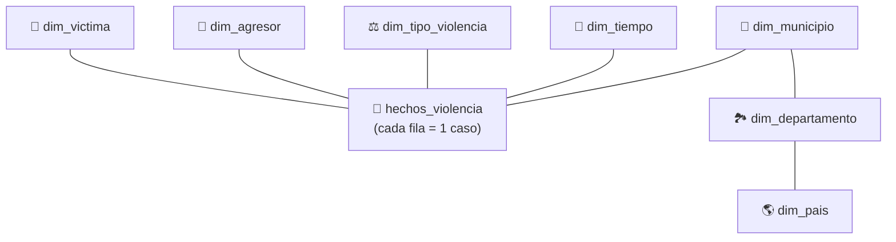

# 📖 Diccionario de Datos
### Data Warehouse — Violencia de Género en Colombia (ODS 5)

---

## 🧭 ¿Qué es este documento?

Este Data Warehouse guarda **hechos de violencia de género** reportados en Colombia (con foco en Bucaramanga), para entender **quién** fue agredido, **quién** agredió, **qué tipo** de violencia ocurrió, **dónde** y **cuándo**. Con esa información se busca aportar evidencia al ODS 5 (Igualdad de Género).

Los datos están organizados en un **esquema estrella**: una tabla central de **hechos** (cada fila = un caso registrado) conectada a varias tablas de **dimensiones** que describen a la víctima, al agresor, el tipo de violencia, el lugar y el momento del hecho.

> 🗄️ `raw_violencia_genero` es aparte: es donde llega el CSV tal cual, **antes** de limpiarlo y organizarlo en las tablas de arriba.

---

## 🗂️ Las 9 tablas, en una frase cada una

| Tabla | ¿Qué guarda? |
|---|---|
| `raw_violencia_genero` | El CSV original sin procesar (respaldo/auditoría) |
| **`hechos_violencia`** | El caso en sí: qué pasó, dónde, cuándo y cómo terminó |
| `dim_victima` | Perfil de la víctima: edad, etapa de vida, salud, ocupación |
| `dim_agresor` | Perfil del agresor: edad, sexo, relación con la víctima |
| `dim_tipo_violencia` | Qué tipo de violencia fue (física, sexual, psicológica, etc.) |
| `dim_tiempo` | Año, mes y semana en que ocurrió |
| `dim_municipio` | Municipio y zona (urbana/rural) donde ocurrió |
| `dim_departamento` | Departamento (ej. Santander) |
| `dim_pais` | País (Colombia) |

---

## 🎯 `hechos_violencia` — la tabla más importante

Analizamos el archivo real exportado del Data Warehouse (`hechos_violencia.csv`, **7,872 casos**) para explicar cada columna con datos reales, no solo en teoría.

| Columna | ¿Qué significa? | Lo que muestran los datos reales |
|---|---|---|
| `id_hecho` | Número único de cada caso | 7,872 casos, ninguno repetido |
| `id_municipio` | En qué municipio ocurrió | 41 municipios distintos |
| `id_tiempo` | Cuándo ocurrió (año/mes/semana) | Casos entre **2008 y 2025** (17 años de historia) |
| `id_victima` | Perfil de la víctima | 172 perfiles distintos (combinaciones de edad, etapa de vida, etc.) |
| `id_agresor` | Perfil del agresor | 621 perfiles distintos |
| `id_tipo_violencia` | Qué tipo de violencia fue | 11 de los 12 tipos posibles ya tienen casos registrados |
| `escenario` | Lugar físico del hecho | **68% ocurre en la vivienda**, 14% en vía pública |
| `zona_conf` | Ámbito de la violencia (código) | ⚠️ El 99.8% quedó con el mismo código sin traducir a texto — ver nota más abajo |
| `con_fin` | Si la víctima quedó viva o no | 99.8% `Vivo`, **11 casos (0.14%) `Muerto` → son los feminicidios** |
| `pac_hos` | ¿La víctima fue hospitalizada? | Sí en el 23% de los casos |
| `sust_vict` | ¿Había alcohol/sustancias en la víctima? | Sí en el 4.5% de los casos |
| `fecha_hecho` / `hora_hecho` | Fecha y hora exacta | La fecha siempre está completa; la **hora falta en el 75% de los casos** |
| `fuente` | De qué dataset viene el registro | El 100% de este extracto es `Historico_Bucaramanga` |

**¿Por qué importa esto para el proyecto?** La columna `con_fin` es la que permite separar **feminicidios** (11 casos) del resto (7,861 casos no fatales) — justo la comparación que pide la pregunta problema de esta entrega. Cruzando esos 11 casos con `escenario`, `id_agresor` y `zona_conf` se puede empezar a describir qué combinación de factores acompaña a los desenlaces fatales.

> ⚠️ **Dos cosas por revisar en el ETL:** (1) `zona_conf` no se tradujo a texto como sí pasó con `escenario`; (2) `hora_hecho` llega vacía la mayoría de las veces. Ninguna de las dos impide el análisis, pero conviene documentarlas como limitación del dataset.

---

## 👤🧑 Las dimensiones, explicadas simple

| Tabla | Columnas clave | En palabras simples |
|---|---|---|
| `dim_victima` | `grupo_edad`, `ciclo_vida`, `tipo_seguridad_social`, `actividad` | Describe **quién sufrió** el hecho: qué edad tenía, en qué etapa de vida está (niñez, adolescencia, adultez...) y a qué se dedica |
| `dim_agresor` | `edad_agre`, `sexo_agre`, `parentezco_vict` | Describe **quién lo hizo**: su edad, sexo y, sobre todo, **qué relación tenía con la víctima** (pareja, expareja, padre, desconocido...) |
| `dim_tipo_violencia` | `naturaleza`, `def_naturaleza` | Dice **qué tipo de violencia fue**: física, psicológica, sexual, negligencia, etc. |
| `dim_tiempo` | `year`, `mes`, `semana` | Permite ver **tendencias en el tiempo** (¿aumentan los casos en ciertos meses o años?) |
| `dim_municipio` → `dim_departamento` → `dim_pais` | `nombre_municipio`, `area`, `nombre_departamento`, `nombre_pais` | Ubica **dónde** ocurrió el hecho, en tres niveles (Colombia → Santander → Bucaramanga, por ejemplo) |

---

## 🔑 Los 2 códigos que hay que saber leer

Para entender los resultados del proyecto, basta con conocer estos dos:

**`con_fin` (condición final):**
| Código/valor | Significado |
|:---:|---|
| `Vivo` | La víctima sobrevivió |
| `Muerto` | **Feminicidio** — el hecho terminó en la muerte de la víctima |
| `Sin información` | No se registró el desenlace |

**`naturaleza` / `def_naturaleza` (tipo de violencia), los más frecuentes en el dataset:**
| Código | Tipo |
|:---:|---|
| 1 | Violencia física |
| 2 | Violencia psicológica |
| 4 | Abuso sexual |
| 5 | Acoso sexual |
| 6 | Violación |
| 12 | Actos sexuales violentos |

*(El listado completo de los 12 códigos, junto con el resto de dominios como `escenario`, `zona_conf` o `parentezco_vict`, está en el DDL original: `sql/esquema_violencia_genero.sql`.)*

---

*Documento complementario al [`README.md`](../README.md) · Proyecto ETL Violencia de Género — ODS 5*

