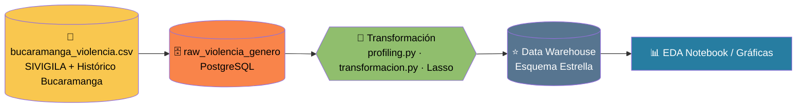
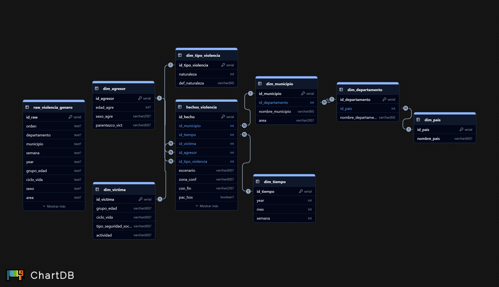
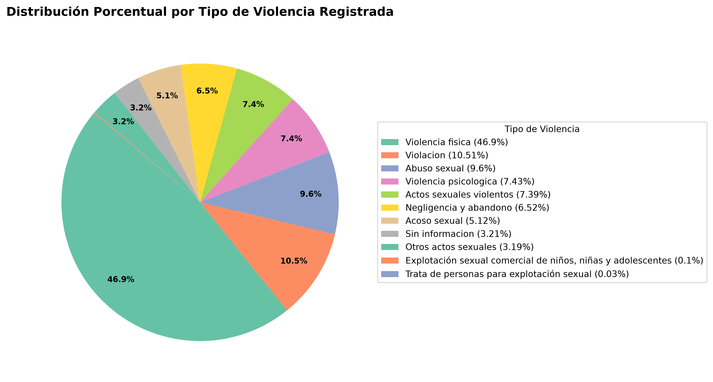
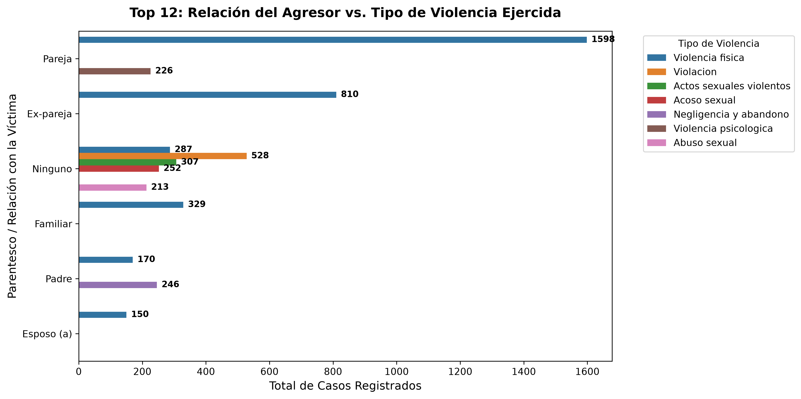
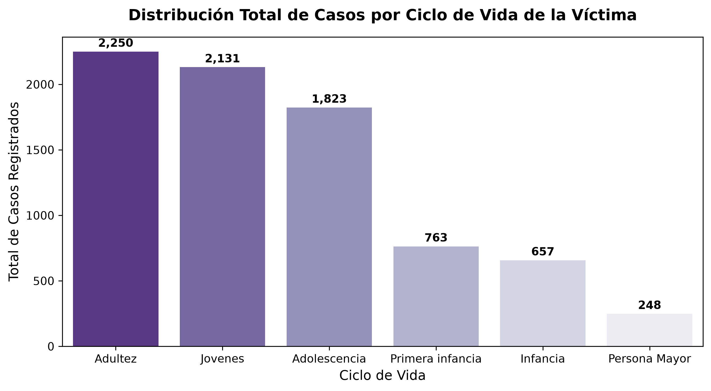

<div align="center">

# 🛡️ Análisis ETL de la Violencia de Género en Colombia
### Un enfoque de datos para el ODS 5 — Igualdad de Género


*Ingeniería de Datos e Inteligencia Artificial · Curso ETL (G51) · Proyecto — Primera Entrega*

</div>

---

## 📑 Tabla de contenido

1. [Objetivo del proyecto](#-objetivo-del-proyecto)
2. [Alineación con los ODS](#-alineación-con-los-ods)
3. [Pregunta problema](#-pregunta-problema)
4. [Fuente de datos y justificación](#-fuente-de-datos-y-justificación)
5. [Arquitectura del proyecto](#-arquitectura-del-proyecto)
6. [Modelo de datos (esquema estrella)](#-modelo-de-datos-esquema-estrella)
7. [Stack tecnológico](#-stack-tecnológico)
8. [Estructura del repositorio](#-estructura-del-repositorio)
9. [Instalación y ejecución](#-instalación-y-ejecución)
10. [Proceso de EDA y selección de variables](#-proceso-de-eda-y-selección-de-variables)
11. [Visualizaciones y hallazgos clave](#-visualizaciones-y-hallazgos-clave)
12. [Diccionario de datos](#-diccionario-de-datos)
13. [Equipo de trabajo](#-equipo-de-trabajo)
14. [Licencia](#-licencia)

---

## 🎯 Objetivo del proyecto

Diseñar y construir un **pipeline ETL completo** (Extracción → Transformación → Carga) que consolide datos oficiales sobre violencia de género en Colombia en un **Data Warehouse relacional**, con el fin de realizar un análisis exploratorio de datos (EDA) y generar visualizaciones que permitan entender **por qué ocurre**, **cómo se manifiesta** y **qué estrategias de prevención** pueden formularse a partir de la evidencia.

Este repositorio corresponde a la **primera entrega** del proyecto del curso de ETL, donde se demuestran conocimientos en gestión de datos, arquitectura de datos y visualización.

## 🌍 Alineación con los ODS

| ODS | Nombre | Vínculo con el proyecto |
|---|---|---|
|  | **Igualdad de Género** | El dataset documenta casos de violencia física, sexual y psicológica contra mujeres en Colombia, permitiendo identificar patrones sociodemográficos que sustenten políticas públicas de prevención. |

## ❓ Pregunta problema

> **Pregunta global:** ¿Por qué ocurre la violencia de género contra las mujeres en Colombia, cómo se manifiesta según los factores sociodemográficos y familiares de víctimas y agresores, y qué estrategias de prevención pueden formularse a partir de un análisis de los datos?

Para esta entrega, el equipo se enfoca en una pregunta específica que aporta evidencia a la pregunta global:

> **Pregunta de esta entrega:** ¿Qué diferencias existen entre los casos de violencia de género con desenlace fatal (feminicidio) y los casos no fatales en Bucaramanga, en cuanto al tipo de violencia, la relación con el agresor, la zona de ocurrencia y la edad de la víctima?

La lógica de trabajo sigue el esquema **Por qué → Cómo → Qué**: se explica *por qué* ocurre el fenómeno (factores de riesgo), *cómo* se manifiesta (tipo de violencia, relación agresor–víctima, contexto), y a partir de ello se plantea *qué* soluciones factibles pueden formularse con respaldo estadístico.

## 📂 Fuente de datos y justificación

| Criterio | Detalle |
|---|---|
| **Dataset principal** | SIVIGILA – Violencia de Género, Colombia (Ministerio de Salud y Protección Social) |
| **Dataset complementario** | `data/bucaramanga_violencia.csv.csv` — Histórico de Violencia de Género en Bucaramanga (7 años de antigüedad) |
| **Tamaño** | +10,000 filas · 32 variables originales |
| **Disponibilidad** | Fuente oficial, pública y abierta |
| **Relevancia** | Variables como `naturaleza` (tipo de violencia), `parentezco_vict` (relación con el agresor), `con_fin_` (condición final, identifica feminicidios) y `area_` (zona rural/urbana) permiten responder directamente la pregunta problema |

**¿Por qué este dataset?** Es una fuente oficial, confiable y pública que cumple ampliamente los requisitos mínimos de la entrega (>10,000 filas y 32 variables). Se complementa con el histórico de Bucaramanga, que aporta una dimensión temporal y local para comparar patrones actuales con los del pasado en Santander, en línea con el **ODS 5**.

## 🏗️ Arquitectura del proyecto

El flujo ETL se compone de tres etapas principales, orquestadas con **Docker** y versionadas con **Git/GitHub**:



1. **Ingesta** (`etl/ingesta.py`): carga el archivo `data/bucaramanga_violencia.csv.csv` hacia la tabla cruda `raw_violencia_genero` en PostgreSQL, sin transformar.
2. **Perfilamiento y transformación** (`etl/profiling.py`, `etl/transformacion.py`): se analiza la calidad del dato crudo (nulos, tipos, duplicados) y se aplica limpieza, normalización y selección de variables (EDA + regularización Lasso).
3. **Carga y análisis** (`sql/esquema_violencia_genero.sql` + `Docs/notebook/eda_violencia.ipynb`): el dataset transformado se carga al Data Warehouse en esquema estrella, sobre el cual se ejecutan las consultas SQL que alimentan el EDA y las gráficas.

### 🐳 Base de datos con Docker

PostgreSQL se levanta como contenedor mediante `docker-compose.yml`, de forma que **cualquier integrante del equipo pueda ejecutar el proyecto sin instalar PostgreSQL de forma nativa** en su computador — esta fue justamente la alternativa usada por una de las integrantes del equipo, mientras que otro integrante trabajó con una instalación local de PostgreSQL. Ambos escenarios son compatibles con este repositorio (ver sección de [Instalación y ejecución](#-instalación-y-ejecución)).

## 🧬 Modelo de datos (esquema estrella)

El Data Warehouse se diseñó como un **esquema estrella** con una **jerarquía geográfica normalizada** (`dim_pais → dim_departamento → dim_municipio`), evitando duplicar información geográfica y permitiendo filtrar fácilmente por país, departamento o municipio (por ejemplo, Colombia → Santander → Bucaramanga).

<div align="center">



</div>

El esquema, definido en `sql/esquema_violencia_genero.sql` (más la tabla cruda en `sql/raw_violencia_genero.sql`), está compuesto por **9 tablas**:

| Tipo | Tabla | Descripción |
|---|---|---|
| Cruda | `raw_violencia_genero` | Dataset original sin transformar, tal como llega del CSV |
| Hechos | `hechos_violencia` | Tabla central: un registro por hecho de violencia |
| Dimensión | `dim_victima` | Características de la víctima (grupo de edad, ciclo de vida, seguridad social, actividad) |
| Dimensión | `dim_agresor` | Características del agresor (edad, sexo, parentesco con la víctima) |
| Dimensión | `dim_tipo_violencia` | Naturaleza / tipo de violencia ejercida |
| Dimensión | `dim_tiempo` | Año, mes y semana epidemiológica del hecho |
| Dimensión | `dim_municipio` | Municipio de ocurrencia y área (cabecera / centro poblado / rural disperso) |
| Dimensión | `dim_departamento` | Departamento de ocurrencia |
| Dimensión | `dim_pais` | País (jerarquía geográfica superior) |

**Tabla de hechos:** `hechos_violencia`
**Dimensiones:** `dim_tiempo`, `dim_victima`, `dim_agresor`, `dim_tipo_violencia`, `dim_municipio`, `dim_departamento`, `dim_pais`

### ¿Por qué estas 4 dimensiones + jerarquía geográfica?

`dim_tiempo`, `dim_victima`, `dim_agresor` y `dim_tipo_violencia` agrupan las columnas del CSV con **mayor peso en la selección de variables con Lasso** (`naturaleza`, `parentezco_vict`, `edad_agre`, `grupo_edad`, etc.) — es decir, las que realmente explican el *por qué* y el *cómo* de la pregunta problema. La jerarquía `país → departamento → municipio` se separó en 3 niveles (en vez de una sola tabla) para conectar Colombia, Santander y Bucaramanga sin duplicar información ni crear una tabla por cada lugar.

### ¿Por qué se descartaron otras columnas del CSV original?

| Columnas descartadas | Motivo |
|---|---|
| `Orden`, `version`, `nom_eve`, `nom_upgd` | Metadatos técnicos del sistema SIVIGILA; no describen el fenómeno de violencia en sí |
| `Barrio`, `Comuna` | Alta inconsistencia/ruido en los nombres, poco valor analítico frente al esfuerzo de limpieza |
| `ndep_resi`, `nmun_resi` (residencia) | Duplicarían la lógica geográfica que ya cubre el departamento/municipio de ocurrencia |

> En una frase: se conservaron las columnas que responden **quién, qué pasó, dónde y cuándo** del hecho de violencia; se descartaron las que eran solo identificadores o metadatos del sistema, sin significado analítico.

## ⚙️ Stack tecnológico

| Capa | Herramienta | Justificación |
|---|---|---|
| **Lenguaje** | Python 3.11 | Estándar en ciencia de datos, amplio ecosistema de librerías (pandas, scikit-learn) |
| **Entorno de análisis** | Jupyter Notebook (`Docs/notebook/eda_violencia.ipynb`) | Permite documentar el EDA de forma reproducible y visual |
| **Base de datos / Data Warehouse** | PostgreSQL | Motor relacional robusto, open source, con excelente soporte para esquemas estrella y consultas analíticas |
| **Contenedores** | Docker + Docker Compose | Estandariza el entorno de base de datos entre integrantes del equipo, sin importar si PostgreSQL está o no instalado de forma nativa en cada máquina |
| **Modelado de datos** | ChartDB / SQL DDL | Diseño y documentación visual del esquema estrella |
| **Selección de variables** | scikit-learn (Regresión Lasso) | Penaliza y descarta variables poco explicativas, dejando solo las relevantes para el problema |
| **Visualización** | Matplotlib / Pandas / SQL | Generación de gráficos KPI directamente desde consultas al Data Warehouse |
| **Control de versiones** | Git / GitHub | Trazabilidad del desarrollo y trabajo colaborativo en equipo |

## 📁 Estructura del repositorio

```
proyecto_etl_violencia_de_genero/
│   .gitignore
│   docker-compose.yml
│   README.md
│
├───data/
│       bucaramanga_violencia.csv.csv
│
├───Docs/
│   ├───Graficas/
│   │   │   diagrama_SQL.png
│   │   │
│   │   └───graficas_primera_entrega/
│   │           01_distribucion_tipo_violencia_torta.png
│   │           02_agresor_vs_tipo_violencia.png
│   │           03_casos_por_ciclo_vida.png
│   │
│   └───notebook/
│           eda_violencia.ipynb
│
├───etl/
│       ingesta.py
│       profiling.py
│       transformacion.py
│
└───sql/
        esquema_violencia_genero.sql
        raw_violencia_genero.sql
```

| Carpeta | Contenido |
|---|---|
| `data/` | Dataset(s) CSV originales (histórico de Bucaramanga) |
| `Docs/Graficas/` | Diagrama del modelo estrella y gráficas de la primera entrega |
| `Docs/notebook/` | Notebook de Jupyter con el EDA completo |
| `etl/` | Scripts Python del pipeline ETL (ingesta, perfilamiento y transformación) |
| `sql/` | DDL del esquema estrella y de la tabla cruda |
| `docker-compose.yml` | Definición del contenedor de PostgreSQL para el equipo |

## 🚀 Instalación y ejecución

Puedes ejecutar el proyecto de **dos formas equivalentes**, según tengas o no PostgreSQL instalado localmente.

### Opción A · Con Docker (recomendada si no tienes PostgreSQL instalado)

```bash
# 1. Clonar el repositorio
git clone https://github.com/<usuario>/proyecto_etl_violencia_de_genero.git
cd proyecto_etl_violencia_de_genero

# 2. Levantar PostgreSQL en un contenedor
docker compose up -d

# 3. Crear entorno virtual e instalar dependencias
python -m venv venv
source venv/bin/activate        # En Windows: venv\Scripts\activate
pip install -r requirements.txt

# 4. Crear el esquema estrella dentro del contenedor
docker exec -i <nombre_contenedor_postgres> psql -U <usuario> -d <nombre_bd> < sql/raw_violencia_genero.sql
docker exec -i <nombre_contenedor_postgres> psql -U <usuario> -d <nombre_bd> < sql/esquema_violencia_genero.sql

# 5. Ejecutar el pipeline ETL
python etl/ingesta.py
python etl/profiling.py
python etl/transformacion.py

# 6. Abrir el notebook de EDA
jupyter notebook Docs/notebook/eda_violencia.ipynb
```

### Opción B · Con PostgreSQL instalado localmente

```bash
git clone https://github.com/<usuario>/proyecto_etl_violencia_de_genero.git
cd proyecto_etl_violencia_de_genero

python -m venv venv
source venv/bin/activate        # En Windows: venv\Scripts\activate
pip install -r requirements.txt

psql -U <usuario> -d <nombre_bd> -f sql/raw_violencia_genero.sql
psql -U <usuario> -d <nombre_bd> -f sql/esquema_violencia_genero.sql

python etl/ingesta.py
python etl/profiling.py
python etl/transformacion.py

jupyter notebook Docs/notebook/eda_violencia.ipynb
```

**Variables de entorno necesarias** (crear un archivo `.env` a partir de `.env.example`, usado tanto por `docker-compose.yml` como por los scripts de `etl/`):

```
DB_HOST=localhost
DB_PORT=5432
DB_NAME=violencia_genero_dw
DB_USER=<usuario>
DB_PASSWORD=<contraseña>
```

> 💡 El `.gitignore` del proyecto excluye el entorno virtual, archivos `.env`, cachés de Python (`__pycache__`) y checkpoints de Jupyter, para mantener el repositorio limpio de binarios y credenciales.

## 🔍 Proceso de EDA y selección de variables

1. **Carga del dataset crudo** (`etl/ingesta.py`) en la tabla `raw_violencia_genero`, preservando todas las columnas originales del CSV.
2. **Perfilamiento de datos** (`etl/profiling.py`): identificación de valores nulos, inconsistencias de formato y duplicados.
3. **Selección de variables con regularización Lasso**: se penalizan y eliminan las columnas/variables que se desvían de la solución del problema y no aportan poder explicativo, conservando únicamente las que sí lo tienen (`naturaleza`, `parentezco_vict`, `edad_agre`, `grupo_edad`, `con_fin_`, `area_`, entre otras).
4. **Transformación y normalización** (`etl/transformacion.py`) de las variables seleccionadas hacia el modelo en esquema estrella.
5. **Carga final** en el Data Warehouse, sobre el cual se ejecutan exclusivamente las consultas SQL (desde `Docs/notebook/eda_violencia.ipynb`) que alimentan el EDA y las visualizaciones — **no se trabaja directamente sobre el CSV original**.

## 📈 Visualizaciones y hallazgos clave

Todos los gráficos siguientes se generaron a partir de **consultas SQL directas al Data Warehouse** y se encuentran en `Docs/Graficas/graficas_primera_entrega/`.

### 1. Distribución porcentual por tipo de violencia registrada

<div align="center">



</div>

La **violencia física** concentra el **46.9%** de los casos registrados, seguida de la **violación (10.51%)** y el **abuso sexual (9.6%)**. Esto confirma que, aunque el dataset se llama "violencia de género", la mayoría de los casos corresponden a violencia física antes que a violencia estrictamente sexual, aunque esta última —sumando violación, abuso, acoso y actos sexuales violentos— agrupa cerca del **35%** de los registros.

### 2. Relación del agresor vs. tipo de violencia ejercida (Top 12)

<div align="center">



</div>

La **pareja** es, por amplio margen, el agresor más frecuente en casos de violencia física (**1,598 casos**), seguida de la **ex-pareja** (**810 casos**). Cuando el agresor es catalogado como "**ninguno**" (persona sin vínculo con la víctima), predominan la violación (528) y los actos sexuales violentos (307), mientras que el **padre** aparece asociado principalmente a **negligencia y abandono** (246 casos). Este patrón evidencia que la violencia física está fuertemente ligada al ámbito de pareja/expareja, mientras que la violencia sexual se distribuye más entre agresores sin vínculo cercano.

### 3. Distribución total de casos por ciclo de vida de la víctima

<div align="center">



</div>

La **adultez** (2,250 casos) y los **jóvenes** (2,131 casos) concentran la mayor cantidad de registros, seguidos de la **adolescencia** (1,823 casos). Los casos en primera infancia, infancia y persona mayor son notablemente menores, lo que sugiere que el riesgo de violencia de género se concentra principalmente entre la adolescencia y la adultez temprana/media.

### Aporte a la pregunta problema

Estos tres hallazgos permiten avanzar hacia la pregunta específica de esta entrega: la violencia física ejercida por parejas o exparejas es el patrón dominante en la población adulta y joven, mientras que los agresores sin vínculo familiar están más asociados a violencia sexual. Cruzando estas variables con la condición final (`con_fin_`) y la zona de ocurrencia (`area_`) en Bucaramanga, el equipo busca caracterizar qué combinación de factores (tipo de violencia, relación con el agresor, zona, edad) diferencia los casos fatales (feminicidio) de los no fatales.

## 📖 Diccionario de datos

La ficha técnica completa de cada una de las 9 tablas del Data Warehouse (columnas, tipos de dato, llaves y reglas de negocio) se encuentra en [`diccionario_datos.md`](./diccionario_datos.md).

## 👥 Equipo de trabajo

| Integrante | Rol | Entorno de trabajo |

| Gustavo | Schema en PostgreSQL, script de transformación y carga, organización del repositorio | GitHub PostgreSQL local |
| Leidy Alomia | Script de ingesta (CSV → raw), EDA, visualizaciones/dashboards | GitHub PostgreSQL en Docker |
| Carlos | Selección de la pregunta complementaria (Bucaramanga) y informe técnico final | diccionario de datos|


> Curso ETL (G51) · Facultad de Ingeniería y Ciencias Básicas · Programa de Ingeniería de Datos e Inteligencia Artificial

## 📄 Licencia

Este proyecto se distribuye con fines académicos bajo la licencia [MIT](./LICENSE). Los datos utilizados provienen de fuentes públicas oficiales (SIVIGILA – Ministerio de Salud y Protección Social de Colombia).

---

<div align="center">

*Proyecto desarrollado en el marco del ODS 5 — Igualdad de Género 🎗️*

</div>